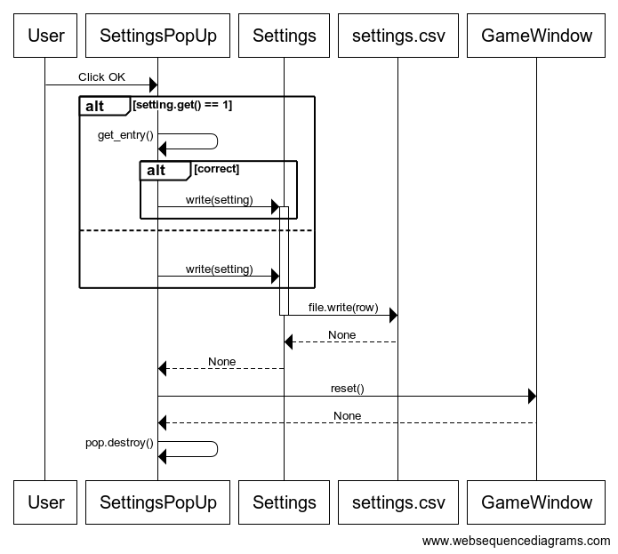
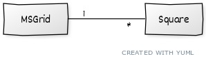

# Arkkitehtuuri

## Pakkausrakenne

Pakkaus rakenne koostuu neljästä kansiosta. Kansio *ui* sisältää käyttöliittymää käsittelevän koodin. *images* kansiosta löytyy *ui* koodin tarvitsemat kuvatiedostot. *ui* tarvitsee toimiakseen *logic* kansiossa sijaitsevan sovelluslogiikan. Sovelluslogiikkan settings käyttää tiedostoa settings.csv, joka löytyy *data* kansiosta.


## Käyttöliittymä

Käyttöliittymässä on kolme mahdollista ikkunaa:
- Pelinäkymä
- Settings -näkymä
- GameOver -näkymä

Näkymistä vastaa järjestyksessä game_window.py, settings_popup.py ja game_over_window.py, joissa on kaikissa määritelty oma luokka. ui.py hallitsee näkymien keskenäisiä välejä. Pelinäkymä on aina nähtävissä. Settings ja GameOver tulevat näkyviin popup-ikkunoina samalla estäen syöttämisen pelinäkymään. 

## Sovelluslogiikka

Sovelluslogiikassa on kolme luokkaa:
- Square
- MSGrid
- Settings

### Setting
Setting luokka vastaa settings.csv tiedoston luomisesta, luennasta ja tiedostoon kirjoittamisesta. Tiedosto sisältää yhden rivin, johon on luetelty pelin korkeus, leveys, miinojen määrä ja neliön muotoisen ruudun sivun pituus pikseleinä. Esimerkiksi:
```
10;10;10;50
```

Esimerkki settings luokan toiminnasta käyttöliittymän kanssa:



### Square ja MSGrid
Square luokka kuvaa yksittäistä ruutua pelissä. MSGrid luo peliruudukon, jossa ruudut ovat Square luokkia. Käyttöliittymä hyödyntää MSGrid luokan peliruudukkon pohjana.



MSGrid luokka tarjoaa käyttöliitymälle ruudukon luomisen lisäksi metodit:
- `zeropath(j, i)`
- `adjacent(j, i)`

Zeropath etsii nollista koostuvan polun, sekä polun seinät. Metodi palauttaa ruutujen koordinaatit ja ruutujen lukumäärän. Kun käyttöliittymässä painetaan 0 arvoista ruutua, metodin avulla saadaan avattua kaikki ruudussa kiinni olevat 0 arvoiset ruudut ja niiden naapurit. 

Adjacent metodilla lasketaan, että jos ruudun ympäriltä on merkattu miinoja sen arvon verran, se avaa kaikki muut piilossa olevat ruudut. Mahdollistaa käyttöliittymän tuplaklikkaus ominaisuuden.
