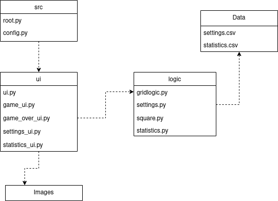

# Arkkitehtuuri

## Pakkausrakenne

Pakkaus rakenne koostuu neljästä kansiosta. Kansio *ui* sisältää käyttöliittymää käsittelevän koodin. *images* kansiosta löytyy *ui* koodin tarvitsemat kuvatiedostot. *ui* tarvitsee toimiakseen *logic* kansiossa sijaitsevan sovelluslogiikan. Sovelluslogiikkan settings käyttää tiedostoa settings.csv ja statistics käyttää tiedostoa statistics.csv. Kummatkin luodaan *data* kansioon. Tiedostojen nimet ovat määritelty config.py tiedostossa.



## Käyttöliittymä

Käyttöliittymässä on neljä mahdollista ikkunaa:
- Pelinäkymä
- Settings -näkymä
- GameOver -näkymä
- Statistics -näkymä

Näkymistä vastaa järjestyksessä game_ui.py, settings_ui.py, game_over_ui.py ja statistics_ui.py. Kaikissa määritelty oma luokka. ui.py hallitsee näkymien keskenäisiä välejä. Pelinäkymä on aina nähtävissä. Settings, GameOver ja Statistics tulevat näkyviin popup-ikkunoina samalla estäen syöttämisen pelinäkymään. 

## Sovelluslogiikka

Sovelluslogiikassa on neljä luokkaa:
- Square
- MSGrid
- Settings
- Statistics

### Setting
Setting luokka vastaa settings.csv tiedoston luomisesta, luennasta ja tiedostoon kirjoittamisesta. Tiedosto sisältää yhden rivin, johon on luetelty pelin korkeus, leveys, miinojen määrä ja neliön muotoisen ruudun sivun pituus pikseleinä.
```
10;10;10;50
```

Esimerkki settings luokan toiminnasta käyttöliittymän kanssa:


### Statistics
Statistics luokka vastaa statistics.csv tiedoston luomisesta, luennasta ja tiedostoon kirjoittamisesta. Tiedostossa on neljä riviä.
```
0;0;0;-1;0;True
1;0;0;-1;0;True
2;0;0;-1;0;True
3;0;0;-1;0;True
```
Rivit vastaavat pelissä tarjottavia ruudukkokokoja. Rivin formaatti on id, voitot, häviöt, paras aika, laskuri voitto-/häviöputkelle ja edellisen pelin tulos(True=häviö ja False=voitto).

### Square ja MSGrid
Square luokka kuvaa yksittäistä ruutua pelissä. MSGrid luo peliruudukon, jossa ruudut ovat Square luokkia. Käyttöliittymä hyödyntää MSGrid luokkaa peliruudukkon pohjana.


MSGrid luokka tarjoaa käyttöliitymälle ruudukon luomisen lisäksi metodit:
- `zeropath(j, i)`
- `adjacent(j, i)`

Zeropath etsii nollista koostuvan polun, sekä polun seinät. Metodi palauttaa ruutujen koordinaatit ja ruutujen lukumäärän. Kun käyttöliittymässä painetaan 0 arvoista ruutua, metodin avulla saadaan avattua kaikki ruudussa kiinni olevat 0 arvoiset ruudut ja niiden naapurit. 

Adjacent metodilla lasketaan, että jos ruudun ympäriltä on merkattu miinoja sen arvon verran, se avaa kaikki muut piilossa olevat ruudut. Mahdollistaa käyttöliittymän tuplaklikkaus ominaisuuden.

## Toiminta
Sovelluksen avautuessa ui.py:ssä alustetaan kaikki logiikan luokat ja referoidaan ne eri näkymistä vastaaville ui luokille. Myös ui luokat referoidaan toisilleen tarvittaessa. Esim GameUI luokalle referoidaan GameOverUI, koska kun peli päättyy GameUI luokassa, GameOverUI vastaa lopetus popupista. Myös sovelluksen menu luodaan. 

GameUI luokka vastaa itse pelin käyttöliitymästä.  Alussa alustetaan useita attribuutteja. Luokan pohjaideana on kuitenkin kaksiuloitteiset ruudukot tkinter buttoneita ja labeleita. Ruudukot ovat tallennettuina sanakirjoihin ja vastaavat logiikan MSGrid luokassa olevaa ruudukkoa. Kun käyttäjä painaa buttonia, tarkistetaan logiikasta ruudun arvo ja otetaan tarvittavat toimenpiteet. Joka tapauksessa ruudulle buttonin tilalle vaihdetaan labeli, jonka kuvana on ruudun arvo tai miina. 

Ruudun arvosta riippuen on muutamaa vaihtoehto. 
Nollille lasketaa zeropathilla koordinaatit nolla-polulle ja naapureille, ja kaikien koordinaattien buttoni vaihdetaan labeliin. Numeroarvolle vaihdetaan pelkkä kyseinen ruutu. Miinoille vaihdetaan ruutu ja siirryttään GameOverUI luokkaan ja lopetus-popuppiin. 

Ruutujen liputus tapahtuu muuttamalla klikatun buttonin kuvaa. Pelin lopussa myös tarkistetaan MSGridin avulla onko liputus mennyt oikein ja väärille vaihdetaan osuvampi kuva. 

Buttoneita ja labeleita ei poisteta missään vaiheessa, vaan samoja käytetään myös seuraavassa pelissä. Jos kuitenkin vaihdetaan pelin kokoa, buttonit ja labelit luodaan uudestaan. 

Muut UI luokat ovat melko suorapuheisia. 

GameOverUI katsoo Settings luokalla pelin asetukset ikkunan geometriaa varten. Asetuksia hyödynnetään myös, kun Statistics luokalla näytetään pelikokoon liityvää statistiikkaa. Tiedot näytetään ikkunassa. Käyttäjällä on kaksi vaihtoehtoa. Sulkea sovellus tai aloittaa uusi peli, jolloin kutsutaan vain GameUI:n reset metodia.

StatisticsUI on hyvin samanlainen ikkuna kuin GameOverUI. Ikkunassa näytetään samoja statistiikkoja, mutta käyttäjän valinnan perusteella.

SettingsUI hyödyntää pelkästään Settings luokkaa. Ikkunassa on optioita pelin koolle tai käyttäjä voi syöttää parametrejä itse. Mikäli valitaan valmis optio tai syöttö on kelpoinen, kirjoitetaan uudet asetukset tiedostoon. Kaikki muut luokat lukevat tiedostosta asetukset ja mukautuvat niiden mukaan.
