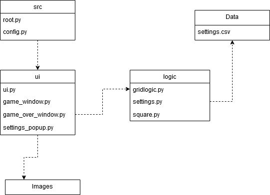

# Arkkitehtuuri

## Pakkausrakenne

Pakkaus rakenne koostuu neljästä kansiosta. Kansio *ui* sisältää käyttöliittymää käsittelevän koodin. *images* kansiosta löytyy *ui* koodin tarvitsemat kuvatiedostot. *ui* tarvitsee toimiakseen *logic* kansiossa sijaitsevan sovelluslogiikan. Sovelluslogiikkan settings käyttää tiedostoa settings.csv, joka löytyy *data* kansiosta.

## Käyttöliittymä

Käyttöliittymässä on kolme mahdollista ikkunaa
- Pelinäkymä
- Settings -näkymä
- GameOver -näkymä

